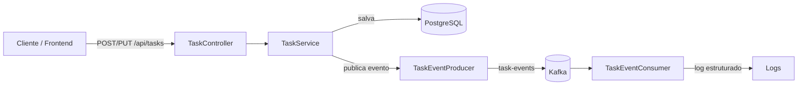

# Task Manager — Desafio Técnico (Java Sênior)

API de tarefas (To-Do) com **CRUD completo** e arquitetura **event-driven**, acompanhada de um
frontend em React. Todo o ambiente sobe via **Docker Compose** (PostgreSQL, Kafka, backend e frontend).

---

## Stack

| Camada        | Tecnologias                                                        |
|---------------|--------------------------------------------------------------------|
| Backend       | Java 17, Spring Boot 3.2, Spring Web, Data JPA, Validation, Actuator |
| Persistência  | PostgreSQL 16, Flyway (migrations)                                  |
| Mensageria    | Apache Kafka (Spring Kafka), tópico `task-events`                  |
| Frontend      | React 18, TypeScript, Vite, Tailwind CSS, axios                    |
| Testes        | JUnit 5, Mockito, Spring MockMvc                                   |
| Build / Exec  | Maven, Docker, Docker Compose                                      |
| CI            | GitHub Actions                                                     |

---

## Arquitetura

O backend segue separação em camadas com baixo acoplamento:

```
com.stefanini.taskmanager
├── domain            Entidades, enums e eventos de domínio (núcleo, sem dependência de framework)
│   ├── Task, TaskStatus
│   └── event/        TaskEvent (sealed), TaskCreatedEvent, TaskUpdatedEvent
├── application       Casos de uso e regras de negócio
│   ├── TaskService   CRUD + publicação de eventos
│   ├── dto/          Create/Update/TaskResponse (records + Bean Validation)
│   └── exception/    TaskNotFoundException
├── infrastructure    Detalhes técnicos (adapters)
│   ├── persistence/  TaskRepository (JPA)
│   └── messaging/    KafkaTopicConfig, TaskEventProducer, TaskEventConsumer
└── api               Camada de entrada HTTP
    ├── TaskController
    ├── GlobalExceptionHandler
    └── ApiError
```

**Princípios aplicados:**
- O `domain` não depende de Spring nem de infraestrutura — regras e contratos de evento ficam isolados.
- O `application` orquestra o caso de uso e dispara eventos sem conhecer detalhes de Kafka (depende de uma abstração de producer).
- Tratamento de erros **centralizado** no `GlobalExceptionHandler`, com respostas padronizadas (`ApiError`).
- **Logs estruturados** (JSON via Logstash encoder no profile `docker`; legível em `local`).
- **Healthcheck** via Spring Actuator (`/actuator/health`).

### Fluxo event-driven



1. Ao **criar** ou **atualizar** uma tarefa, o `TaskService` persiste a mudança e publica um evento
   (`TaskCreatedEvent` / `TaskUpdatedEvent`) no tópico **`task-events`**, usando o `id` da tarefa como
   chave (garante ordenação por tarefa na partição).
2. O `TaskEventConsumer` (`@KafkaListener`) consome o evento de forma **desacoplada** e registra um
   log estruturado. Esse consumidor é um ponto de extensão natural (ex.: notificações, auditoria,
   projeções) sem alterar o caso de uso original.

---

## Modelo de dados

Entidade `Task`:

| Campo        | Tipo          | Observação                                  |
|--------------|---------------|---------------------------------------------|
| `id`         | Long          | PK auto-incremento                          |
| `titulo`     | String (150)  | Obrigatório                                 |
| `descricao`  | String (1000) | Opcional                                    |
| `status`     | Enum          | `PENDENTE`, `EM_ANDAMENTO`, `CONCLUIDO`     |
| `dataCriacao`| OffsetDateTime| Preenchido na criação                       |

Schema versionado por Flyway em `backend/src/main/resources/db/migration/V1__create_tasks_table.sql`.

---

## API REST

Base: `/api/tasks`

| Método | Rota               | Descrição                | Resposta            |
|--------|--------------------|--------------------------|---------------------|
| POST   | `/api/tasks`       | Cria uma tarefa          | `201 Created` + body |
| GET    | `/api/tasks`       | Lista todas as tarefas   | `200 OK`            |
| GET    | `/api/tasks/{id}`  | Busca tarefa por id      | `200 OK` / `404`    |
| PUT    | `/api/tasks/{id}`  | Atualiza uma tarefa      | `200 OK` / `404`    |
| DELETE | `/api/tasks/{id}`  | Remove uma tarefa        | `204 No Content` / `404` |

Exemplo de criação:

```bash
curl -X POST http://localhost:8080/api/tasks \
  -H "Content-Type: application/json" \
  -d '{"titulo":"Estudar Kafka","descricao":"Producer e consumer","status":"PENDENTE"}'
```

Erros seguem o formato padronizado:

```json
{
  "timestamp": "2026-06-15T12:00:00Z",
  "status": 400,
  "error": "Bad Request",
  "message": "Erro de validação",
  "path": "/api/tasks",
  "fieldErrors": [{ "field": "titulo", "message": "titulo é obrigatório" }]
}
```

---

## Execução local (Docker Compose)

Pré-requisitos: **Docker** e **Docker Compose**.

```bash
# 1. (opcional) copie as variáveis de ambiente
cp .env.example .env

# 2. suba todo o ambiente
docker compose up --build
```

Serviços e portas:

| Serviço   | URL / Porta                         |
|-----------|-------------------------------------|
| Frontend  | http://localhost:3000               |
| Backend   | http://localhost:8080               |
| Health    | http://localhost:8080/actuator/health |
| PostgreSQL| localhost:5432 (`taskdb`)           |
| Kafka     | localhost:9092 (externo)            |

Para acompanhar os **logs do consumidor Kafka**:

```bash
docker compose logs -f backend
```

Ao criar/atualizar tarefas pelo frontend, aparecerão logs do tipo
`Evento de tarefa recebido ... eventType=CREATED taskId=...`.

### Variáveis de ambiente

| Variável            | Default     | Descrição                          |
|---------------------|-------------|------------------------------------|
| `POSTGRES_DB`       | `taskdb`    | Nome do banco                      |
| `POSTGRES_USER`     | `taskuser`  | Usuário do banco                   |
| `POSTGRES_PASSWORD` | `taskpass`  | Senha do banco                     |

O backend recebe `DB_URL`, `DB_USERNAME`, `DB_PASSWORD` e `KAFKA_BOOTSTRAP_SERVERS` via compose
(profile `docker`). O Kafka usa dois listeners: `kafka:29092` (interno, usado pelo backend) e
`localhost:9092` (externo, para acesso pelo host).

---

## Desenvolvimento sem Docker

**Backend** (requer JDK 17 + Maven; Postgres e Kafka podem subir via compose):

```bash
cd backend
mvn spring-boot:run            # usa o profile default (localhost)
```

**Frontend** (requer Node 20):

```bash
cd frontend
npm install
npm run dev                    # http://localhost:5173 (proxy /api -> :8080)
```

---

## Testes

```bash
cd backend
mvn test
```

Cobertura do fluxo principal:
- `TaskServiceTest` — CRUD + disparo de eventos (Mockito, `ArgumentCaptor`).
- `TaskControllerTest` — endpoints e tratamento de erros (`@WebMvcTest` + MockMvc).
- `TaskEventProducerTest` — publicação no tópico com chave correta (KafkaTemplate mockado).
- `TaskEventConsumerTest` — processamento do evento.

---

## CI/CD (GitHub Actions)

Workflow em `.github/workflows/ci.yml`, disparado em `push`/`pull_request` para `main`:

- **backend**: JDK 17 + cache Maven → `mvn clean verify` (compila e roda os testes), publicando os
  relatórios do Surefire como artefato.
- **frontend**: Node 20 → `npm install` + `npm run build` (type-check + build de produção).

> O lockfile do frontend (`package-lock.json`) ainda não está commitado; por isso CI e Docker usam
> `npm install`. Ao gerar e commitar o lockfile, recomenda-se trocar para `npm ci`.

---

## Decisões técnicas e trade-offs

- **Camadas (domain/application/infrastructure/api)** em vez de pacotes por tipo: mantém o núcleo de
  negócio independente de framework e facilita testes e evolução. Trade-off: mais pacotes para um
  escopo pequeno, compensado pela clareza e pelo peso de organização na avaliação.
- **Eventos como `record` + `sealed interface`**: payload imutável e enxuto (carrega `taskId`, não a
  entidade), permitindo consumo polimórfico no listener com baixo acoplamento ao modelo persistido.
- **Kafka via Spring Kafka com serialização JSON**: simples de operar localmente; em produção o ideal
  seria um schema registry (Avro/Protobuf) para versionamento de contrato.
- **`PUT` para atualização completa** (em vez de `PATCH` parcial): contrato mais simples e previsível
  para o escopo atual.
- **Flyway com `ddl-auto: validate`**: o schema é versionado por migration e o JPA apenas valida,
  evitando divergências entre código e banco.
- **Frontend com proxy `/api`**: tanto em dev (Vite) quanto em produção (nginx) o front chama `/api`,
  eliminando configuração de CORS.
- **`npm install` em vez de `npm ci`**: pragmático na ausência de lockfile commitado (ver nota de CI).

---

## Escalabilidade e evolução

A solução foi estruturada para crescer sem reescrita. Pontos de evolução previstos:

**Escala horizontal do backend**
- O serviço é **stateless** (sem sessão em memória), então pode rodar em N réplicas atrás de um
  load balancer. Cada instância participa do mesmo **consumer group** (`task-manager`), e o Kafka
  distribui as partições do tópico entre elas automaticamente.
- Aumentar as **partições** do tópico `task-events` (hoje 1) eleva o paralelismo de consumo; como a
  chave da mensagem é o `taskId`, a ordenação por tarefa é preservada dentro da partição.

**Entrega confiável de eventos**
- Hoje a publicação ocorre após o commit da transação. Para garantir atomicidade entre persistência
  e publicação, o próximo passo natural é o **Transactional Outbox** (gravar o evento numa tabela na
  mesma transação e relayá-lo ao Kafka), evitando perda de evento em falhas.
- No consumidor, adotar **idempotência** (deduplicação por id do evento) e uma **Dead Letter Queue**
  para mensagens que falham repetidamente.

**Contrato de eventos**
- Evoluir do JSON atual para um **Schema Registry** (Avro/Protobuf), versionando o contrato e
  permitindo evolução compatível entre produtores e consumidores.

**Persistência**
- Adicionar **paginação e filtros** no `GET /api/tasks` (ex.: `Pageable`) antes que o volume cresça.
- Escala de leitura via **read replicas** do PostgreSQL; o índice em `status` já antecipa filtros comuns.

**Operação e observabilidade**
- Logs já são estruturados (JSON); o passo seguinte é exportá-los para um stack centralizado
  (ELK/Loki) e expor **métricas** via Actuator + Micrometer/Prometheus, com tracing distribuído
  (OpenTelemetry) cobrindo o fluxo HTTP → Kafka → consumer.

**Arquitetura**
- A separação em camadas mantém o domínio isolado de framework, viabilizando extrair novos
  consumidores (notificações, auditoria, projeções CQRS) ou até promover o consumidor a um
  microsserviço independente sem tocar no caso de uso de escrita.

---

## Uso de IA neste desafio

Este projeto foi desenvolvido com auxílio do **GitHub Copilot (modelo Claude Opus 4.8)** dentro do
**VS Code**, de forma incremental e revisada bloco a bloco.

Como a IA foi utilizada:
- **Scaffolding e estrutura**: estrutura do monorepo, `pom.xml`, configuração de profiles, Dockerfiles
  e `docker-compose.yml`.
- **Implementação guiada por camadas**: entidade, eventos, repository, producer/consumer Kafka,
  service, DTOs, controller e exception handler, seguindo a arquitetura definida previamente.
- **Testes**: testes unitários (Mockito) e de controller (MockMvc).
- **Frontend**: setup do Vite + Tailwind e componentes de listagem/criação com cliente HTTP tipado.
- **Documentação**: este README, incluindo diagramas e descrição do fluxo event-driven.

Todas as decisões de arquitetura e stack foram definidas e validadas manualmente; a IA atuou como
acelerador de implementação, com revisão humana a cada etapa.
